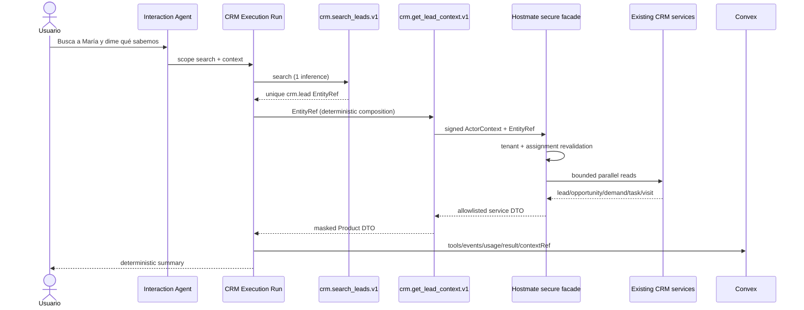

# CRM Get Lead Context vertical slice

Status: implemented and validated as the second read-only CRM Product Tool. Feature-gated, not deployed, and not enabled for production users.

## 1. Arquitectura

`crm.get_lead_context.v1` is a bounded Product Tool in the `crm` profile. It consumes a real `EntityRef`, calls the signed Hostmate internal adapter, reauthorizes the lead, and only then fans out through a thin read-only facade to existing domain services. MySQL/Prisma remain behind Hostmate services; Convex remains the durable control plane.



## 2. Permission scope

- `agent`: lead must be in the signed effective tenant and `assigned_agent_id` must equal `ActorContext.userId` on every call.
- `admin`: tenant-wide read inside the signed effective tenant.
- `superadmin`: same effective-tenant lock; the model cannot choose another tenant.
- Unknown/foreign-tenant IDs return `NOT_FOUND`; unassigned or reassigned leads return `PERMISSION_DENIED`; references to records already merged into another lead return `STALE_REFERENCE`.
- Authorization is completed before related services are called, so filtering never happens after data exposure.

## 3. Servicios reutilizados

The Hostmate facade uses only existing domain services:

1. `lead.service.getById` for tenant-scoped identity, contact, status, assignment and linked property.
2. `opportunity.service.getByLead` for the latest opportunity.
3. `demand.service.getByLead` for an active/latest demand.
4. `task.service.getByLead` for at most five pending tasks.
5. `visit.service.getById` only when the lead has a linked `visit_id`, returning it only if upcoming and active.

The four related reads run in parallel after authorization. The facade contains no SQL or Prisma and does not duplicate domain search logic.

## 4. Tool contract

Canonical ID `crm.get_lead_context.v1`, version `1`, namespace/name `crm.get_lead_context`, capability `crm.lead.context`, permission `crm.read`, mode `read`, risk `R0`.

The only LLM-visible input is:

```ts
{ lead: { type: "crm.lead", id: string, label?: string, deepLink?: string } }
```

The schema is strict. Text search, `leadId`, user, assignment and tenant fields are rejected.

## 5. DTO

The Product DTO contains a compact lead identity/contact summary, CRM status/source/qualification, assigned agent name, linked property, latest opportunity, active demand, next linked visit and up to five pending tasks. Phone and email use the same masking policy as search. IDs that are not needed by the user are removed.

It excludes tenant IDs, database rows, raw email/HTML, full qualification payloads, timeline, notes, messages, matches, secrets, provider payloads and long histories. Those remain candidates for dedicated tools.

## 6. EntityRefs

Search emits `crm.lead` EntityRefs. Context accepts one, validates type/shape, checks that the service response matches the requested ID, and reauthorizes it server-side. A ref is never treated as proof of access.

## 7. Composition

One CRM Execution Run is used for the concrete task. A composed objective receives the exact scope `[search_leads, get_lead_context]`. OpenRouter performs one scoped search inference; if and only if `total === 1` and one EntityRef is returned, the runtime invokes context deterministically. This is simpler than two dependent runs while preserving separate tool events, latencies and policy checks.

## 8. Conversational context

Selected refs are persisted as semantic `contextRefs` (`selected.lead`, optional `selected.visit`, and `referenced`) on Agent Platform conversation messages, not in Memory. “El segundo” resolves against the latest durable `entity_list`; a later “¿Qué sabemos de él?” reuses the selected lead. Explicit card selection sends the EntityRef with the turn. Every follow-up still calls context and reauthorizes. Legacy array-shaped messages remain readable.

## 9. Ambiguity

Multiple search matches return `needs_input` plus the entity list. Context is not called and no candidate is chosen by the LLM. An unresolved pronoun replays the candidates and requests a selection rather than starting another search.

## 10. Reassignment race

Search authorization is not cached. If Agent A resolves a lead and the lead is reassigned to Agent B before context, `lead.service.getById` sees the current assignment and the facade returns `PERMISSION_DENIED` before loading related data. Tests cover this race.

## 11. AI Chat

AI Chat supports simple lookup, direct name-to-context, composed lookup-to-context, card selection, ordinal selection and pronoun follow-up. Entity cards retain a separate CRM deep link and provide a 44px selection action. This tool still exposes only its compact next-visit summary; detailed history now belongs to the separate `visits.list_lead_visits.v1` Product Tool.

## 12. AI Platform

Executions displays profile/version, exact one- or two-tool scope, lifecycle events for each call, requested/resolved model, provider, inference count, tokens, cost, duration and result status. Context-only follow-ups show zero model inferences and deterministic finish.

## 13. OpenRouter

Search argument extraction remains one OpenRouter call with `tool_choice: required` and deterministic stop after tool result. Context composition and rendering do not use a second cosmetic generation. A future synthesis call should be introduced only when a larger DTO materially benefits from prose reasoning.

## 14. Performance

Latest real composed E2E:

| Metric | Result |
|---|---:|
| Interaction | 14 ms |
| Execution | 4,827 ms |
| Search service | 2,591.01 ms |
| Context facade | 988.92 ms |
| OpenRouter | 3,769 ms |
| Model calls | 1 |
| Tokens | 195 input / 15 output |
| Cost | USD 0.000102 |
| Convex events | 12 |
| Durable messages after reconnect | 2 |
| Inserted Convex records | 19 |
| Convex document writes including patches | 27 |
| CRM writes | 0 |

No query optimization was made. `lead.service.list` remains the largest measured domain latency; context uses bounded parallel reads with no observed N+1 loop.

## 15. Tests

Fork: 102/102 tests pass plus typecheck and debug build. Hostmate focused backend: 27/27 tests pass. Web lint and production build pass. Coverage includes Agent A/B assignment, admin tenant scope, cross-tenant lookup, strict EntityRefs, unknown/unassigned/reassigned/merged leads, sanitized DTO, unique/multiple/zero search, minimal tool scope, ordinal/pronoun continuity, no repeated search, no unnecessary synthesis and durable reconnect. The live E2E uses real OpenRouter, Hostmate services, production MySQL read and local Convex/JWKS.

## 16. Riesgos

- Historical CRM authorization remains inconsistent outside Agent Platform; this slice deliberately does not refactor it.
- `lead.service.getById` trusts existing relational integrity for its linked property.
- `visit_id` may not represent every historical/future visit relation, so the DTO promises only the linked next-visit summary.
- The runtime and stable JWKS/key rotation are not deployed.

## 17. Deuda técnica

Add managed runtime deployment, key rotation, retention, deployed browser smoke tests and production observability. Consider optimizing `lead.service.list` only after profiling. Reassignment intentionally remains `PERMISSION_DENIED`; merged-record references use `STALE_REFERENCE`.

## 18. Recomendación para la siguiente capability

The proposed lead-visits capability has been implemented canonically as `visits.list_lead_visits.v1`, owned by Visits and importable by CRM. Its proposed successor is now implemented as `visits.get_visit.v1`; see `VISITS_GET_VISIT_VERTICAL_SLICE.md`.
