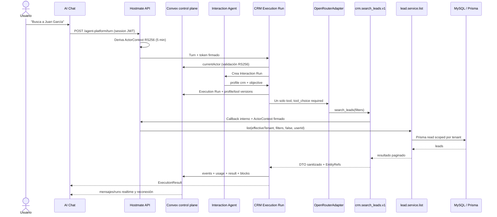

# CRM Search Leads vertical slice

Status: implemented and validated as the first read-only Product Tool on the Boop-derived Agent Platform. The capability remains feature-gated and has not been deployed or enabled for product users.

## 1. Arquitectura real del slice

The browser posts a natural-language turn to the authenticated Hostmate API. Hostmate derives a short-lived RS256 ActorContext token from the existing session and proxies only the turn to the isolated runtime. Convex validates the token and provides the trusted actor. The runtime records an Interaction Run, resolves a `crm` Execution Run with one tool, asks OpenRouter to call it, and deterministically renders its structured result. The Product Tool reaches Hostmate through a signed internal callback, which calls `lead.service.list`; the agent never imports Prisma or SQL.



## 2. Archivos modificados

Core/fork: contracts for `ExecutionResult`, the CRM Product Tool and Hostmate HTTP port, the vertical-slice runner, OpenRouter deterministic tool completion, authenticated Convex HTTP adapter, generic control-plane projections, Convex schema/functions, runtime HTTP app, E2E script and tests.

Hostmate Product: signed token bridge, signed internal CRM adapter, app route mount, Agent Platform chat page, realtime execution detail, data references, navigation copy, environment example and API tests. No existing CRM service, Prisma schema or legacy assistant implementation was changed.

## 3. Tool contract

Canonical ID: `crm.search_leads.v1`, version `1`, namespace/name `crm.search_leads`, owner/profile `crm`, capability `crm.lead.search`, permission `crm.read`, mode `read`, risk `R0`.

LLM-visible filters are only `query`, `city` and `status`. `query` maps to the existing service search across `client_name`, `client_phone` and `client_email`; `city` maps to the existing `prop_city`; status uses the five real shared values. Page and limit are not model-controlled: backend fixes page 1 and limit 5. Strings and request messages are bounded. Unknown fields fail.

## 4. ActorContext

Hostmate derives tenant, user, role, permissions, session, locale/timezone, permissions version and effective-tenant-override from the authenticated server request. The claims are signed RS256 for five minutes. Convex validates issuer, audience and JWKS before the runtime constructs a frozen ActorContext. The same signed token authenticates the internal domain callback. No authority field exists in the tool JSON Schema.

## 5. Policy

The registry and `DefaultPolicyEngine` require `crm.read`, active feature status, `crm` compatibility and read-only mode. Unauthorized actors stop before OpenRouter and before `lead.service`. The internal callback rechecks permission independently. Tool arguments are strict at the runtime parser and again at the handler boundary.

## 6. Profile/tool scoping

The Interaction boundary forwards only profile `crm`, objective class `lead.lookup`, capability `crm.lead.search` and the original objective. The resolver allowlist contains only `crm.search_leads.v1`. Runs persist profile version `1`, the exact scope `crm.search_leads.v1@1`, registry hash and skill version (`resolve-ambiguous-lead@1`).

## 7. Domain Service utilizado

The signed Hostmate adapter calls:

```ts
leadService.list(actor.tenantId, {
  page: 1,
  limit: 5,
  search: query,
  prop_city: city,
  status,
}, false, actor.userId)
```

Passing `isSuperAdmin=false` is deliberate: the Product Tool is always locked to the effective signed tenant. Existing search, ordering, joins and Prisma access remain in `v2/apps/api/src/services/lead.service.ts`.

## 8. DTO

The internal adapter allowlists only lead ID, client name/contact, CRM status, linked property title/reference, assigned agent name and creation time. The Product Tool masks phone/email, converts dates, removes tenant/raw/internal fields and caps candidates at five. Raw Prisma entities, messages, HTML, provider metadata and tenant IDs never cross the tool result.

## 9. EntityRefs

Each result includes `{ type: "crm.lead", id, label, deepLink }`. The deep link opens `/leads?lead=<id>`. It is output-only: attempts to inject `EntityRef`, `leadId`, `tenantId`, `tenant_id` or assigned-agent IDs into arguments fail strict validation.

## 10. Interaction flow

The Interaction Run is deterministic and contains no CRM parsing or service access. It records the user objective and dispatches `profile: crm`. Filter extraction occurs inside the scoped Execution model call. This keeps Interaction lightweight and prevents a second LLM call after the tool result.

## 11. Execution flow

The Execution Run resolves its profile, skill and one-tool registry; creates an attempt; records lifecycle events; forces `tool_choice: required`; executes one OpenRouter round; validates model arguments in Zod; binds optional city/status to explicit textual evidence; invokes the Product Tool; builds the common ExecutionResult; and completes deterministically. Empty optional strings are treated as omitted. Unsupported/invented optional filters are not sent to the service.

## 12. Convex events

Events correlate conversation, Interaction Run, Execution Run and attempt IDs. The generic timeline records `interaction.started`, `interaction.dispatch.resolved`, `execution.started`, `tool.requested`, `model.started`, `tool.started`, `tool.completed`, `model.completed`, and `execution.completed` (or normalized failure/permission events). Event payloads pass through the Foundation redactor.

## 13. AI Platform rendering

`/ai-platform/executions` remains a generic run view. Rows show kind, parent relationship, profile/version, objective, exact tool scope, status, duration, requested/resolved model and provider. Expanding an Execution Run subscribes to its usage and event timeline, showing tokens, cost, model latency, finish reason and fallback state.

## 14. Chat rendering

`/ai-platform/chat` is a separate Agent Platform surface and does not modify Sara/Eva/chatbot. User and assistant messages are durable Convex records. Candidate output uses a typed `entity_list` block with CRM links and compact allowlisted fields, not Markdown-only rendering. The conversation ID is stable per tenant/user in browser storage; Convex remains the durable source.

## 15. Multi-tenant tests

Contract tests run the same name against actors from tenant A and tenant B and verify disjoint outputs. Hostmate adapter tests sign separate tenant tokens and assert `lead.service.list` receives only the signed tenant. Malicious foreign ID/filter/EntityRef/tenant fields and direct handler payloads are rejected before domain access.

## 16. Permissions

Observed product behavior is inconsistent: `GET /api/v2/leads` has no role middleware and `lead.service.list` does not restrict normal agents to assigned leads, while the React CRM route is admin-only. Therefore the real backend read scope is “all non-deleted leads in the current tenant” for authenticated agent/admin; this tool matches that backend scope and adds no invented ownership rule. It intentionally does not inherit the service's unfiltered cross-tenant superadmin mode. The inconsistency is documented, not silently changed in existing CRM routes.

## 17. Ambiguity handling

Zero matches returns `completed` with a clear no-results summary. Exactly one total match returns `completed` with one card. More than one total match returns `needs_input`, candidate cards and a request to select/refine; it never picks a lead or expands scope. Ambiguous language only uses filters grounded in the objective. Unit coverage includes zero, one, multiple, name, phone, email, city and supported combinations.

## 18. OpenRouter usage

The live E2E used the Foundation `OpenRouterAdapter`, not a mocked E2E provider. Provider-level `strict: true` was removed because OpenAI rejects useful optional fields unless every property is required; runtime Zod remains strict and `additionalProperties: false` remains in JSON Schema. `stopAfterToolResult` avoids a cosmetic second generation and exposes structured tool results.

Observed route: requested/resolved `openai/gpt-4.1-mini`, upstream `OpenAI`, finish reason `tool_calls`, one model call, 191 input tokens, 15 output tokens and USD `0.0001004`.

## 19. Performance

Latest passing live run against a real tenant lead and real MySQL data:

| Segment | Observed |
|---|---:|
| Interaction Run | 20 ms |
| Execution Run | 3,405 ms |
| OpenRouter | 3,356 ms |
| `lead.service.list` | 2,302.28 ms |
| Model calls | 1 |
| Lifecycle events recovered | 9 |
| Messages recovered after new client | 2 |
| Total harness time including local Convex/JWKS startup | 13,967 ms |
| CRM writes | 0 |

The dominant product-path costs were OpenRouter and the existing lead list service. No premature query rewrite was made.

## 20. Tests

Fork suite: 94 tests passed before final documentation, including 13 new/extended CRM/OpenRouter tests. Hostmate focused API suite: 10 tests passed, including eight signed internal-adapter tests. Web TypeScript lint passed. The live E2E used an ephemeral RS256 issuer/JWKS, local Convex, a fresh Convex client for reconnect, real OpenRouter, real `lead.service.list` and real MySQL reads. Production had no exact “Juan García” record in tenants 1/7/9/11, so that literal utterance is covered deterministically in runtime tests; the live run selected an existing real lead by phone and returned one match.

## 21. Problemas encontrados

1. Foundation emitted provider `strict: true` with optional JSON Schema fields; OpenAI rejected it before tool execution.
2. OpenAI filled optional `city` with an empty string; the handler now treats only empty optional strings as omitted.
3. OpenAI invented `status: new` and `limit: 1` in an early live run. Pagination is now backend-owned, and city/status require objective evidence.
4. Hostmate route/UI/service permission semantics are historically inconsistent as described above.
5. `lead.service.list` took about 2.3 seconds in the passing live read; it remains untouched.
6. The unrelated pre-existing API typecheck error for missing `appendIgDmOpenTracking` remains and was not modified.

## 22. Deuda técnica

Before enabling users, deploy the fork runtime as a managed service, configure stable JWKS/key rotation and runtime URLs, add retention policy for Agent Platform conversations, and add a browser smoke test in the deployed dev environment. Product should also decide whether normal agents may read all tenant leads or only assigned leads, then align route, UI and service in a separate authorization change. `llm_logs` is not used by this runtime; Agent Platform usage/events are canonical, avoiding duplicate logging. If a future requirement needs a MySQL `llm_logs` link, store only its correlation ID.

## 23. Recomendación para la siguiente capability

After this slice is reviewed, the best second capability is a read-only `crm.get_lead_context` that accepts the output EntityRef and reuses an existing domain service. It should not be implemented until permission semantics and this first slice are approved. No write, task, visit, property, demand or communication tool was added here.
